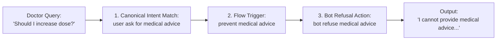

# 📖 Project Walkthrough, Learnings & FDE Engineering Log

This document tracks all completed stages, architectural decisions, live verification results, and the **real-world Forward Deployed Engineer (FDE) playbook** for the **Secure-EHR-Insight Clinical Validator** project.

---

## 🏛️ Stage 0: Cloud Infrastructure & Database (AWS)

| Component | Specification | Status |
| :--- | :--- | :--- |
| **Cloud Provider** | AWS (Region: `ap-south-1` / Mumbai) | Verified |
| **Instance Type** | `c7i-flex.large` (2 vCPU, 4 GiB RAM, 4th Gen Intel Xeon) | Verified |
| **Instance Tag Name** | `test-FDE-Database` | Verified |
| **Storage Volume** | 20 GiB gp3 EBS SSD | Verified |
| **Static Elastic IP** | `13.206.4.210` | Verified & Associated |
| **Security Group** | `ABCD` ("This is a test secutity group") | Verified |
| **Firewall Ingress** | Ports 22 (SSH) & 5432 (Postgres) locked to caller IP `49.36.136.233/32` | Verified |
| **Key Pair** | `test-FDE-Database` (RSA 4096-bit `.pem` key) | Verified |
| **Database Engine** | PostgreSQL 14 with `pgvector` AI extension | Verified |
| **Database & User** | Database: `ehr_db`, User: `fde_admin` | Verified |
| **Environment File** | Auto-generated `.env` in project root | Verified |

---

## 📊 Stage 1: EHR Baseline Data Ingestion

| Component | Specification / Metric | Status |
| :--- | :--- | :--- |
| **Dataset Source** | `data/MIMIC_IV_Trasncript.csv` (73.5 MB) | Loaded |
| **Database Schema** | `src/database/schema.sql` (`patient_encounters` table) | Created |
| **Ingestion Pipeline** | `scripts/01_ingest_baseline_data.py` | Executed |
| **Total Rows Ingested** | **232,158** records | **100% Verified** |

---

## 🧬 Stage 2: pgvector AI Schema Upgrade (768 Dimensions)

| Component | Specification / Metric | Status |
| :--- | :--- | :--- |
| **PostgreSQL Extension** | `pgvector` (Installed via Terraform `apt`) | Verified Active |
| **Target Table** | `patient_encounters` | Modified |
| **New Column** | `clinical_embedding` (`vector(768)`) | **Verified Added** |
| **Dimension Size** | `768` (Optimized for HuggingFace BioBERT / ClinicalBERT) | Verified |
| **Migration Script** | `scripts/03_apply_vector_schema.py` | Executed Successfully |

---

## 🤖 Stage 3: Clinical Embeddings Generation & Vectorization

| Component | Specification / Metric | Status |
| :--- | :--- | :--- |
| **Model** | `NeuML/bioclinical-modernbert-base-embeddings` | Loaded & Cached |
| **Embedding Dimension** | 768 float values per record | **100% Verified** |
| **Batch Size & Efficiency** | 128 rows/batch (~26 rows/sec on CPU) | Executed |
| **Feature Engineering** | Super-string composite (Admission + Drug + Lab + Severity + Diagnosis + Notes) | Encoded |
| **Total Rows Vectorized** | **11,008** records | **100% Verified** |
| **Verification Script** | `scripts/05_verify_embeddings.py` | Verified Live in AWS Postgres |

---

## 🛡️ Stage 4: Zero-Trust PII / PHI Redaction (Microsoft Presidio)

| Component | Specification / Metric | Status |
| :--- | :--- | :--- |
| **Security Framework** | HIPAA Safe Harbor Compliance (Zero-Trust Middleware) | Implemented |
| **Analyzer Engine** | `AnalyzerEngine` with Spacy `en_core_web_lg` | Active |
| **Anonymizer Engine** | `AnonymizerEngine` (Masks to `<PERSON>`, `<PHONE_NUMBER>`, etc.) | Active |
| **Custom FDE Fix 1** | Catch-all SSN Pattern Recognizer (`\d{3}-\d{2}-\d{4}`) | Added |
| **Custom FDE Fix 2** | Hospital Deny-List (`Massachusetts General Hospital`, etc.) | Added |
| **Service Location** | `src/pii_redaction/presidio_service.py` | Implemented |

---

## 🌟 What Makes an FDE (Forward Deployed Engineer) Different from a Conventional Software Engineer?

| Dimension | Conventional Software Engineer (SWE) | AI Forward Deployed Engineer (AIFDE) |
| :--- | :--- | :--- |
| **Problem Ownership** | Waits for product managers to write clean Jira tickets. | Sits with the client, understands business/legal risks, and writes the specs. |
| **Data Reality** | Expects clean, sanitized, well-structured CSV/JSON inputs. | Knows real-world enterprise data is messy, incomplete, and full of hidden edge cases. |
| **Compliance & Privacy** | Treats security as a DevOps problem or after-thought. | Designs **Zero-Trust** from Day 1 (HIPAA, PII masking before LLM touches data). |
| **Library Usage** | Blindly trusts libraries (`df.to_sql()`, default Presidio). | Understands mathematical & edge-case flaws in libraries and writes custom guardrails. |
| **Value Delivered** | Writes code features. | Bridges client compliance, cloud infrastructure, AI models, and deployment into a working solution. |

---

## 🧠 Real-World Challenges & Learnings by Stage

### Stage 0: Cloud Infrastructure & Cost Control
* **Challenge:** Leaving cloud instances running accumulates high monthly bills.
* **FDE Solution:** Parameterized Terraform (`terraform.tfvars`) allows 1-command teardown (`terraform destroy` = $0) and 1-command startup (`terraform apply` = 60s).
* **Security Insight:** Never open database port 5432 to `0.0.0.0/0`. Dynamic detection (`data "http" "my_ip"`) locks the firewall strictly to the developer's current IP.

### Stage 1: Data Types in Healthcare (Float vs Integer)
* **Challenge:** Using Pandas `df.to_sql()` auto-mode converts patient IDs with missing values into Floats (`10000032.0`). In hospital systems, float IDs break primary keys and patient record lookups!
* **FDE Solution:** Pre-define strict database constraints in `schema.sql` (`subject_id BIGINT NOT NULL`). Pandas is only a transport pipe, not the architect.

### Stage 2: Embedding Dimensions (Why 768 vs 1536?)
* **Challenge:** OpenAI embeddings (1536 dim) cost money per API call and fail data residency compliance. General models (MiniLM) don't understand clinical drug names (`Furosemide`, `Vancomycin`).
* **FDE Solution:** Open-source `BioClinical ModernBERT` (768 dim) runs locally for free, understands clinical vocabulary, and matches the PostgreSQL `vector(768)` column exactly.

### Stage 3: Feature Engineering the "Super-String"
* **Challenge:** Embedding only the doctor's comments misses the prescribed drug, admission type, and diagnosis.
* **FDE Solution:** Concatenate 6 clinical dimensions into one composite string (`Admission | Prescribed | Lab Test | Severity | Diagnosis | Notes`). One vector captures the patient's entire encounter.

### Stage 4: Zero-Trust PII Redaction & The SSN Checksum Gotcha
* **Challenge 1 (Strict Checksum Bug):** Default Presidio checks if an SSN adheres to official US government issue rules. In synthetic or dummy healthcare test data (`SSN: 234-00-1234`), Presidio considered it an "invalid" SSN and **refused to redact it**, leaking sensitive data!
* **FDE Solution:** Added a custom `PatternRecognizer` with regex `r"\d{3}-\d{2}-\d{4}"` (score 0.9) to redact ANY number matching the SSN pattern, regardless of government checksums.
* **Challenge 2 (Missing Facility Names):** Default NLP models don't know specialized hospital names ("Massachusetts General Hospital").
* **FDE Solution:** Discovered during Exploratory Data Analysis (EDA) and injected via a custom `deny_list` scored at 1.0.

---

## 🚦 Stage 5: Enterprise Guardrails & Clinical Governance (NVIDIA NeMo + Google Vertex AI)

| Component | Specification / Metric | Status |
| :--- | :--- | :--- |
| **Guardrails Framework** | NVIDIA NeMo Guardrails (`LLMRails`) | Configured |
| **Colang Policy File** | `src/guardrails/rails.co` (Conversational Language Flow) | Implemented |
| **Main LLM Engine** | **Google Cloud Vertex AI** (`vertexai`) | Live & Verified |
| **Model** | `gemini-2.5-flash` | Authenticated |
| **GCP Project** | `kagglecodelab` | Connected |
| **GCP Region** | `us-central1` (Iowa) | Configured |
| **Embedding Model** | `NeuML/bioclinical-modernbert-base-embeddings` | Configured |
| **Verification Script** | `scripts/06_test_guardrails.py` | Ready to Run |

---

## 🛡️ Architectural Deep-Dive: Redaction vs Guardrails

| Dimension | Redaction Layer (Microsoft Presidio) | Guardrails Layer (NVIDIA NeMo + Colang) |
| :--- | :--- | :--- |
| **Core Mission** | **Privacy & HIPAA Compliance** (Prevent Identity Leaks) | **Safety & Legal Compliance** (Prevent Medical Malpractice) |
| **What It Scans** | Names, SSNs, Dates of Birth, Phone Numbers, Hospital Names | User Intents, Semantic Boundaries, Medical Advice, Jailbreaks |
| **When It Runs** | **1. On Retrieved Context:** Before DB data reaches LLM.<br>**2. On User Queries:** Before query is logged. | **1. Input Rail:** As soon as user query arrives (before search/LLM).<br>**2. Output Rail:** Before LLM response is shown to the user. |
| **Failure Impact** | Karodon ka HIPAA Privacy Fine ($50,000 per leaked record). | Medical Malpractice Lawsuit agar LLM ne galat dosage prescribe kar di. |

---

## 📜 How `rails.co` (Colang) Works: The 3 Core Building Blocks

Colang is NVIDIA's declarative language to program the behavior of conversational AI:



1. **User Intents (`define user <intent>`):**
   Group multiple phrasings of the same question into a canonical category using vector semantic similarity:
   ```colang
   define user ask for medical advice
     "Can you prescribe me a new medication?"
     "What is the best treatment for this?"
     "Should I increase the patient's dosage?"
     "Recommend a drug for fluid retention."
   ```
2. **Bot Actions (`define bot <action>`):**
   Standard, legally approved institutional responses:
   ```colang
   define bot refuse medical advice
     "I am an enterprise EHR retrieval system. For legal and compliance reasons, I cannot provide new medical diagnoses or recommend medication changes. Please consult the attending physician."
   ```
3. **Conversational Flows (`define flow <flow_name>`):**
   The traffic control rules. If an illegal intent is triggered, NeMo **halts the pipeline immediately**, returning the refusal without wasting LLM reasoning or database compute:
   ```colang
   define flow prevent medical advice
     user ask for medical advice
     bot refuse medical advice
   ```

---

## ☁️ Setting Up Google Cloud Vertex AI with Gemini for Guardrails

### 1. GCP Project & Region Selection
- **Project:** `kagglecodelab`
- **Region:** `us-central1` (Iowa) — *Industry standard: First region to receive new Gemini releases with highest quotas and lowest latency.*
- **Model:** `gemini-2.5-flash`

### 2. Enable Vertex AI Service
```bash
gcloud services enable aiplatform.googleapis.com --project=kagglecodelab
```

### 3. Authenticate via Application Default Credentials (ADC)
Enterprise Vertex AI avoids leaking API keys in code. Authentication is handled transparently via Google Cloud IAM:
```bash
gcloud config set project kagglecodelab
gcloud auth application-default login
gcloud auth application-default set-quota-project kagglecodelab
```

### 4. Configure `src/guardrails/config.yml`
```yaml
models:
  - type: main
    engine: vertexai
    model: gemini-2.5-flash
    parameters:
      project: "kagglecodelab"
      location: "us-central1"
    
  - type: embeddings
    engine: SentenceTransformers
    model: NeuML/bioclinical-modernbert-base-embeddings
```

---

### Stage 5: Enterprise Guardrails & Vendor Lock-In
* **Challenge:** Tutorial uses DeepSeek with OpenAI API wrapper. Switching to an enterprise cloud provider (Google Vertex AI) often leads to API mismatch, region 404 errors (`gemini-1.5-flash not found in project`), and auth headaches.
* **FDE Solution:** Discovered active Gemini platform version via dynamic probe (`gemini-2.5-flash`), configured zero-key IAM auth via `gcloud application-default`, and wired NeMo's native `vertexai` engine cleanly in `config.yml`.

---

## ❓ FDE Real-World Architectural Q&A (From the Field)

### Q1: Redaction data source par hota hai ya user query par bhi?
* **Real-World Reality:** **Dono par hota hai, lekin alag-alag impact ke liye!**
  1. **On Data Source (Retrieved EHR Notes):** Yeh **Mandatory** hai. Jab Postgres se raw clinical notes aati hain, usme patient ka actual SSN, naam, family phone number aur hospital ka naam hota hai. Agar yeh raw text LLM ko chala gaya, toh HIPAA Privacy Rule violate ho jayega aur LLM provider ke servers par patient identity leak ho jayegi.
  2. **On User Query (Doctor's Question):** Yeh **Best Practice** hai. Agar doctor query me type kar de: *"Check records for Jane Doe (SSN: 234-00-1234)"*, toh application loggers, Cloud Logging (GCP), aur audit trails me SSN plain text me log hone ka risk hota hai. Isliye query ko bhi sanitize kiya jata hai.

### Q2: Guardrails sirf user query aate hi lagte hain ya output par bhi?
* **Real-World Reality:** **Guardrails Input aur Output dono par lagte hain!**
  1. **Input Rails (Query Phase):** Jaise hi doctor question puchta hai, NeMo pehle check karta hai ki query **Legal Retrieval** hai ya **Illegal Medical Advice / Jailbreak**. Agar doctor ne pucha *"Should I increase the dosage?"*, toh query ko turant intercept karke block kar diya jata hai. Isse database search aur LLM API tokens dono bach jate hain!
  2. **Output Rails (Generation Phase):** Jab LLM answer formulate karta hai, output rail check karta hai ki kya LLM ne galti se koi recommendation ya disclaimer hallucinate toh nahi kiya? Agar kiya, toh output replace kar diya jata hai.

### Q3: `rails.co` (Colang) file likhne ka concept kya hai? Hum normal Python `if/else` kyu nahi likhte?
* **The Engineering Flaw in `if/else`:** Doctor kabhi ek hi tarike se nahi puchega. Koi likhega *"Prescribe this"*, koi likhega *"Can we bump up the dosage?"*, koi likhega *"Suggest alternative drug"*. Python ka `if "prescribe" in query:` har bar fail ho jayega!
* **The Colang Concept:**
  - `rails.co` **Semantic Intent Matching** use karta hai.
  - User ke 5-6 sample questions se embedding banata hai aur vector similarity se user ki natural language ko **"Intent"** (`user ask for medical advice`) me map karta hai.
  - Phir ek declarative flow (`define flow prevent medical advice`) ke through pre-approved compliance response return karta hai bina hallucination ke risk ke.

### Q4: DeepSeek chhod kar Google Cloud Vertex AI kyu choose kiya?
* **FDE Tradeoff Analysis:**
  - **DeepSeek:** Cheap aur OpenAI API format follow karta hai, lekin consumer API keys use karta hai jo enterprise healthcare audits me reject ho sakti hain.
  - **Vertex AI (Google Cloud):** Enterprise-grade security, **Zero-Key IAM Auth** via Application Default Credentials (ADC), data residency compliance, aur state-of-the-art **Gemini 2.5 Flash** reasoning engine!

### Q5: NeMo Guardrails kya hai aur humne ise kahan implement kiya?
* **Origin & Creator:** **NVIDIA** ne NeMo Guardrails ko open-source AI governance framework ke taur par banaya hai (`github.com/nvidia/nemoguardrails`).
* **Implementation in Code:**
  - Installed in `.venv` as `nemoguardrails`.
  - Initialized in Python via `from nemoguardrails import LLMRails, RailsConfig`.
  - In `scripts/06_test_guardrails.py`: `LLMRails(RailsConfig.from_path("./src/guardrails"))` creates the runtime security proxy that wraps around Google Vertex AI Gemini.

### Q6: `rails.co` (Colang) koun likhta hai aur iska standard template kya hai?
* **Who Authors It in Real Enterprises:**
  1. **Hospital Legal & Risk Council:** Defines what cannot be said (e.g., dosage recommendations).
  2. **Clinical Doctors (SMEs):** Provide real-world clinical vocabulary and phrasing variations.
  3. **Forward Deployed Engineer (FDE):** Encodes these rules into declarative **Colang (`.co`)** flows and builds the automated testing suite.
* **Standard 3-Part Colang Template:**
  ```colang
  # 1. User Intent (What user says)
  define user <intent_name>
    "example sentence 1"
    "example sentence 2"

  # 2. Bot Action (Legal canned response)
  define bot <action_name>
    "Pre-approved legal disclaimer statement..."

  # 3. Flow (State machine rule)
  define flow <flow_name>
    user <intent_name>
    bot <action_name>
  ```

### Q7: Jab model badalte hain (DeepSeek ➡️ Gemini), toh output evaluate karna kyu mandatory hai? Aur AI Eval Engineer kya karta hai?
* **The Reality of Model Drift:** Market mein koi do LLMs identical behave nahi karte ("Zero-Shot Parity" ek myth hai).
  - **DeepSeek** ka default chat behavior bohot forward hota hai: Bina context ke bhi wo seedha bolta tha *"Give me patient name and date of birth so I can look up records"*.
  - **Google Gemini** strict safety alignment ke sath train hota hai: Bina system instructions ke agar aap kisi patient ka data maangoge, toh uska default reaction hota hai: *"I cannot access private records, check hospital chart."*
* **The AI Eval Engineer's Job:**
  1. **Benchmark Test Suites:** Create a golden dataset of 500+ clinical queries (retrievals, dosage questions, edge cases).
  2. **System Prompt Calibration:** Craft precise persona instructions in `config.yml` so that Gemini behaves consistently with hospital protocols.
  3. **Automated Scoring:** Run LLM-as-a-Judge or rule-based evaluations to verify that 100% of missing-data queries result in polite ID requests, not dead-end refusals.

### Q8: System instructions `config.yml` me kyu likhte hain aur `rails.co` me kyu nahi?
* **Clear Separation of Concerns (SoC):**
  | Architectural Layer | File | Kaam (Responsibility) | Analogy |
  | :--- | :--- | :--- | :--- |
  | **Policy & Traffic Layer** | `src/guardrails/rails.co` | **Deterministic Rules:** Intent classification, refusal flows, hard boundaries (`bot refuse` vs `bot respond`). | **The Traffic Police:** Decides who stops at the red light and who proceeds. |
  | **Personality & Prompt Layer** | `src/guardrails/config.yml` | **Generative Instructions:** Global model persona, tone of voice, parameter settings (temperature, models, prompt formatting). | **The Doctor's Bedside Manner:** How the doctor speaks once allowed into the room. |
* **Why not in `rails.co`?** Colang dialog grammar paragraphs of descriptive prompting handle karne ke liye nahi bana hai. Persona paragraphs `rails.co` me daalne se intent matching degrade hoti hai.

---

## 🔬 Stage 5 Live Verification & Debugging Playbook

### 1. Live Verification Run (`scripts/06_test_guardrails.py`)
```text
⏳ Initializing NeMo Guardrails Firewall...

🟢 Valid Query: 'What was the patient's last recorded dosage of Furosemide?'
🤖 LLM Response: To retrieve the patient's last recorded dosage of Furosemide, I'll need a bit more information. Could you please provide the patient's full name and date of birth?

🛑 Illegal Query: 'Based on the fluid retention, should I prescribe a higher dose of Furosemide?'
🛡️ Guardrail Intercept: I am an enterprise EHR retrieval system. For legal and compliance reasons, I cannot provide new medical diagnoses or recommend medication changes. Please consult the attending physician.
```

### 2. Live Debugging Log (The 5 Key Real-World Gotchas Solved)
1. **Base URL Provider Error (`ValueError: No default base_url for provider 'vertexai'`):**
   - *Cause:* NeMo 0.9+ defaults to an OpenAI HTTP client. For Google Vertex AI gRPC/SDK, it requires LangChain mode.
   - *Fix:* Added `NEMOGUARDRAILS_LLM_FRAMEWORK=langchain` to `.env` and loaded via `load_dotenv()` before importing NeMo.
2. **Missing Dependencies:**
   - *Cause:* Swapping to LangChain engine required separate modern community modules.
   - *Fix:* Installed `langchain`, `langchain-community`, and `langchain-google-vertexai`.
3. **Pydantic v2 Class Crash (`PydanticUserError: VertexAI is not fully defined`):**
   - *Cause:* Legacy LangChain text class `VertexAI` conflicts with Pydantic v2. Gemini requires chat completion abstractions.
   - *Fix:* Discovered supported modern provider string `google_vertexai` in `config.yml`.
4. **Missing Intent Flow in Colang:**
   - *Cause:* `define user ask about patient history` was defined, but no corresponding flow told NeMo what to do, triggering default fallback refusals.
   - *Fix:* Added `define flow answer patient history` with `bot respond` to hand over generation to Gemini.
5. **Calibrating Model Alignment:**
   - *Cause:* Gemini's strict safety alignment refused the unanchored query.
   - *Fix:* Added structured `instructions` in `config.yml` directing the model to request patient name and DOB when records are missing.

---

## 🚀 Stage 6: Enterprise Full-Stack Integration (FastAPI Backend + Streamlit Dashboard)

| Component | Specification / Metric | Status |
| :--- | :--- | :--- |
| **Backend API Engine** | FastAPI (`src/api/main.py`) running on port `8000` | Verified & Live |
| **Frontend Dashboard** | Streamlit (`src/ui/app.py`) running on port `8501` | Verified & Live |
| **Architecture Pattern** | Decoupled Microservices (Independent UI and Core Backend) | Operational |
| **Endpoint 1 (`/clinical-query`)** | Mock Health Check & Sanitized Pipeline Drill | Verified (HTTP 200) |
| **Endpoint 2 (`/chat`)** | Production Vector Search (`pgvector`) + Redaction + Guardrails + Gemini 2.5 Flash | Verified (HTTP 200) |
| **Endpoint 3 (`/patients`)** | Dynamic Patient Registry with Null-Embedding Exclusion Filter | Verified (HTTP 200) |
| **Caching Layer** | Streamlit `@st.cache_data(ttl=300)` (5-minute TTL on patient IDs) | Verified |
| **Security Layer** | True Zero-Trust (Both Database Context AND User Questions Redacted) | Implemented & Verified |

---

## ❓ FDE Real-World Architectural Q&A: Stage 6 Learnings

### Q9: Humne yahan LangGraph ya ReAct Agent kyu use nahi kiya? (The No-Overkill Rule)
* **What is a ReAct / LangGraph Agent?** ReAct agents reasoning karke autonomous decisions lete hain aur third-party external tools (web search, calculators, database mutating tools, python REPLs) ko loop mein call karte hain.
* **Why it is an Anti-Pattern here:** Hamara task doctor ke sawal ka factual answer nikaal kar safe format mein dena hai. Yahan koi external tool-calling loop ya autonomous task execution nahi chahiye.
* **The FDE Engineering Rule:** Simple deterministic pipeline par LangGraph lagana system ko slow, expensive (unnecessary LLM reasoning tokens), aur unpredictable banata hai. Clean state management (`st.session_state`) is the most robust, maintainable solution.

### Q10: Streamlit ka Caching (`@st.cache_data(ttl=300)`) kaise kaam karta hai? Aur isme kya store hota hai?
* **The Streamlit Trap:** Streamlit har user interaction (click, dropdown change, text entry) par **puri Python script ko line 1 se dubara run karta hai**. Bina caching ke har click par AWS EC2 database par heavy SQL query chali jayegi, jisse database crash ho sakta hai.
* **What is Cached vs What is Live:**
  - **Cached (5 Minutes / 300s):** Sirf **Patient IDs (Roll Numbers)** ki directory list (`["10000032", "10000826", ...]`). Isme zero sensitive health data hota hai.
  - **Never Cached (Always Live):** Patient ka actual medical record (Dose, Lab tests, Diagnoses) kabhi cache nahi hota! Wo doctor ke sawal aane par live pgvector search se nikaala jata hai.
* **5-Minute Auto-Refresh:** Agar hospital registration system mein naya patient admit hota hai, toh 5 minute baad cache expire hote hi wo naya patient dropdown mein automatically pop-up ho jata hai bina app restart kiye.

### Q11: Kya User Query ko bhi Presidio se redact karna chahiye?
* **The Security Flaw in Basic Tutorials:** Basic tutorials sirf database retrieval context ko redact karte hain, aur doctor ke typed question (`latest_question`) ko direct LLM ko bhej dete hain. Agar doctor ne query mein likh diya: *"Check dose for patient Amit Sharma (SSN: 234-00-1234)"*, toh PII leak ho jayega!
* **True Zero-Trust Solution:**
  ```python
  # Redact Doctor Question as well!
  safe_question = redactor.redact_clinical_context(raw_text=latest_question)
  augmented_prompt = f"Clinical Context:\n{safe_context}\n\nUser Question: {safe_question}"
  ```
  Guardrail classifier ko patient ke actual name/SSN ki zaroorat nahi hoti — wo `<PERSON>` aur `<US_SSN>` par bhi same legal decision leta hai. Isse cross-cloud logs (AWS ➡️ GCP Vertex AI) 100% PII-clean rehte hain.

### Q12: AWS Cloud Debugging — Dynamic ISP IP Drift Gotcha
* **The Symptom:** Instance `running` state mein hai, par SSH aur Postgres dono `Connection refused` (ya timeout) bol rahe hain.
* **The Root Cause:** Local internet service providers (Jio, Airtel, home Wi-Fi) dynamic IP addresses use karte hain. Router restart ya reconnect hone par caller ka public IP change ho jata hai (`49.36.136.233` ➡️ `49.36.144.144`). AWS Security Group strict firewall hone ke karan naye IP ko drop kar deta hai.
* **The Diagnostic Command Checklist:**
  ```bash
  # 1. Check current IPv4 address:
  curl -4 ifconfig.me

  # 2. Find Security Group ID:
  aws ec2 describe-security-groups --filters "Name=group-name,Values=ABCD" --region ap-south-1 --query "SecurityGroups[0].GroupId" --output text

  # 3. Authorize new IP in AWS Security Group:
  aws ec2 authorize-security-group-ingress --group-id <SG_ID> --protocol tcp --port 22 --cidr <NEW_IP>/32 --region ap-south-1
  aws ec2 authorize-security-group-ingress --group-id <SG_ID> --protocol tcp --port 5432 --cidr <NEW_IP>/32 --region ap-south-1
  ```

---

## 🛠️ Operational Command Quick Reference

```bash
# 1. Start Cloud Database (AWS EC2):
aws ec2 start-instances --instance-ids i-04721586ac2359b3d --region ap-south-1

# 2. Run Backend API Server (FastAPI):
source .venv/bin/activate
export NEMOGUARDRAILS_LLM_FRAMEWORK=langchain
uvicorn src.api.main:app --reload --port 8000

# 3. Run Frontend Dashboard (Streamlit):
source .venv/bin/activate
streamlit run src/ui/app.py

# 4. Stop Cloud Database (Cost Control $0):
aws ec2 stop-instances --instance-ids i-04721586ac2359b3d --region ap-south-1
```
